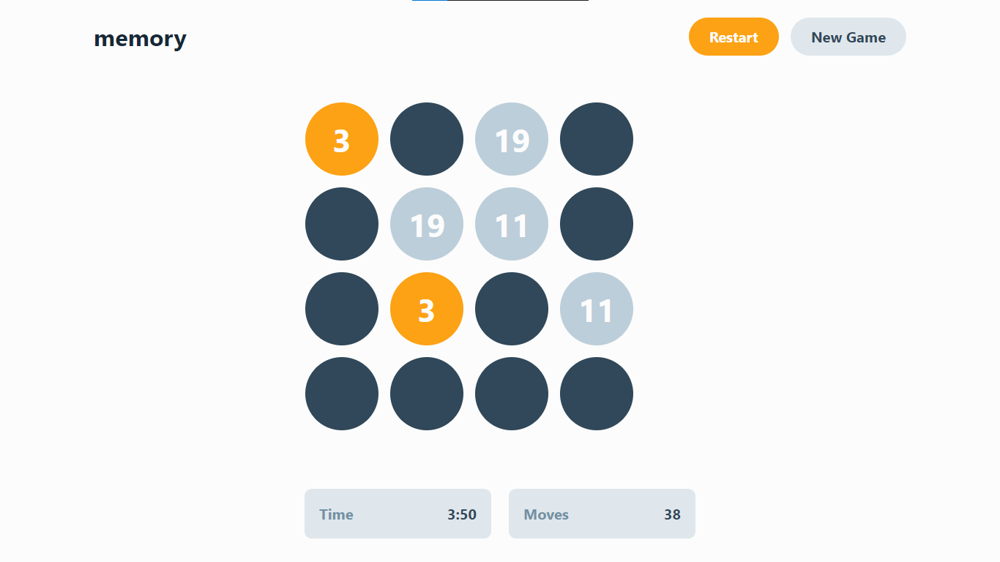
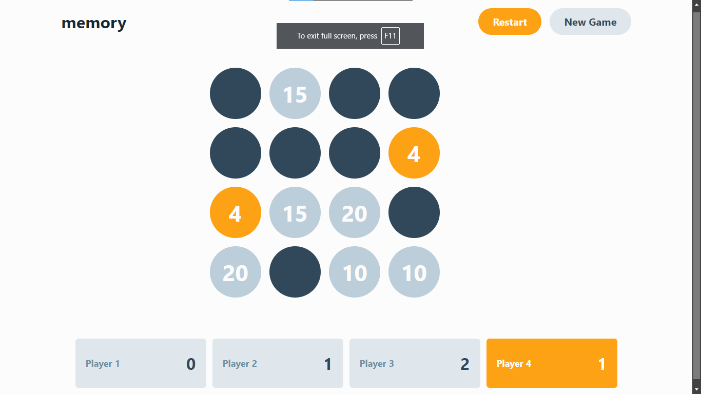
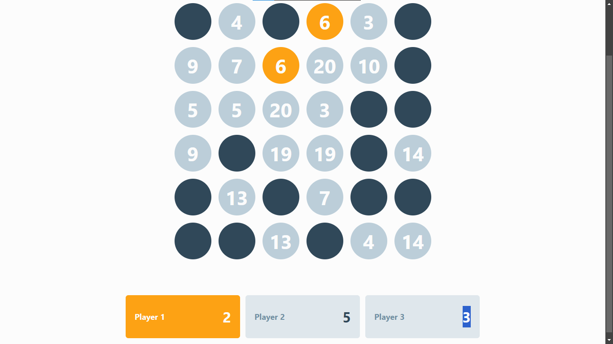
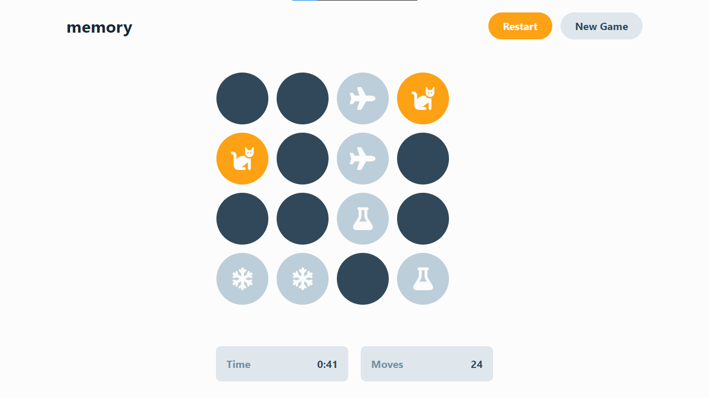
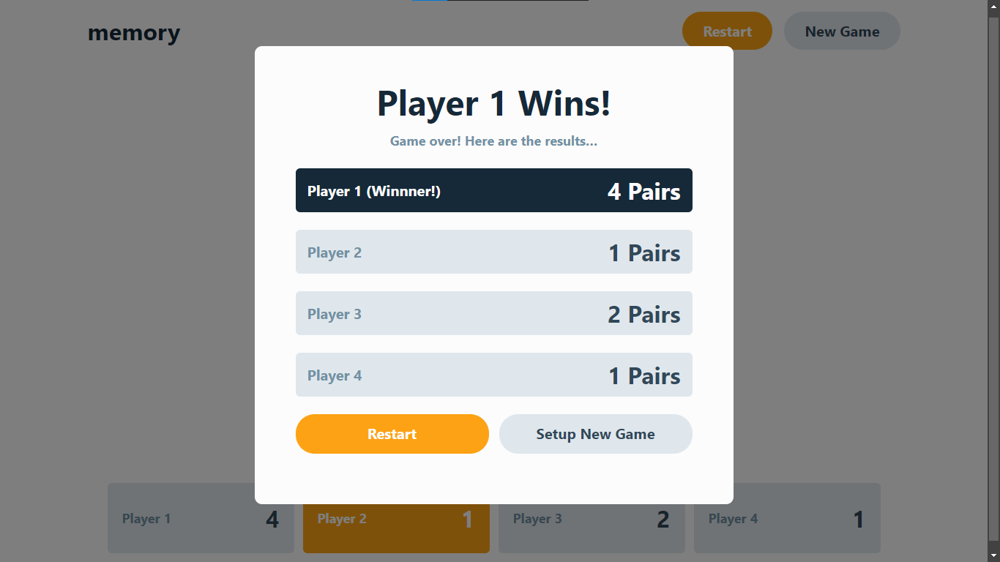

# Memory Game

This is a solution to the [Memory game challenge on Frontend Mentor](https://www.frontendmentor.io/challenges/memory-game-vse4WFPvM). Frontend Mentor challenges help you improve your coding skills by building realistic projects.

## Table of contents

- [Overview](#overview)
  - [The challenge](#the-challenge)
  - [Screenshot](#screenshot)
  - [Links](#links)
- [My process](#my-process)
  - [Built with](#built-with)
  - [What I learned](#what-i-learned)
  - [Useful resources](#useful-resources)
- [Author](#author)
- [Acknowledgments](#acknowledgments)

## Overview

### The challenge

Users should be able to:

- View the optimal layout for the game depending on their device's screen size
- See hover states for all interactive elements on the page
- Play the Memory game either solo or multiplayer (up to 4 players)
- Set the theme to use numbers or icons within the tiles
- Choose to play on either a 6x6 or 4x4 grid

### Screenshot

    

### Links

- Live Site URL: [live site URL](https://memory-game-nu-roan.vercel.app/)

## My process

1. create test first approches (TDD)
2. implements logic without styling
3. add styling mobile first (no test to validate styling)
4. add media queries for responsiveness

### Built with

- [Vue js](https://vuejs.org/) - JS Framework
- [Tailwindcss](https://tailwindcss.com/) - CSS Library

### What I learned

I learned how to use Vue Router and various Vue features such as computed, watch, ref, and useRouter.
Additionally, I learned how to use computed to create derived data and watch to react to changes in data.

### Useful resources

- [Vue Router](https://router.vuejs.org/)


## Project Setup

```sh
npm install
```

### Compile and Hot-Reload for Development

```sh
npm run dev
```

### Type-Check, Compile and Minify for Production

```sh
npm run build
```
